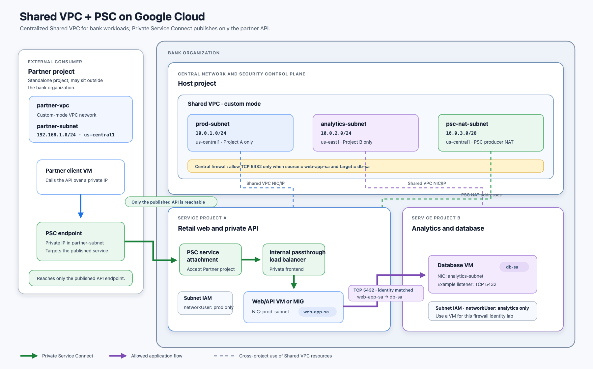

# Shared VPC + PSC on Google Cloud

> **Sample project** — this repository exists to demonstrate cloud networking design skills on Google Cloud. Nothing here is a production system; it is a worked reference architecture with the reasoning behind each decision.



## What this demonstrates

A four-project banking-style architecture that combines two core GCP networking patterns — **Shared VPC** for centralized bank workloads and **Private Service Connect** for publishing a single API to an external partner:

- **Shared VPC (custom mode)** — a central host project owns the network; two service projects run workloads on subnets they are granted access to, giving a single control plane for the network and its firewalling.
- **Subnet-level least-privilege IAM** — service project A gets `roles/compute.networkUser` on `prod-subnet` only; service project B on `analytics-subnet` only.
- **Identity-based firewalling** — east-west traffic (web tier to database on TCP 5432) is allowed by *service account identity* (`web-app-sa` → `db-sa`), not by IP ranges.
- **Private Service Connect (PSC)** — an external partner consumes a single published API through a PSC endpoint in its own project. The API, not the network, is the trust boundary: the partner reaches only the published service.
- **Network observability** — VPC Flow Logs on the bank subnets are routed to a BigQuery dataset via a logging sink in the host project, so east-west and PSC traffic can be queried.


## Topology at a glance


| Project           | Role                                        | Key resources                                                                                                                     |
| ----------------- | ------------------------------------------- | --------------------------------------------------------------------------------------------------------------------------------- |
| Host project      | Central network and security control plane  | Shared VPC, `prod-subnet` (10.0.1.0/24), `analytics-subnet` (10.0.2.0/24), `psc-nat-subnet` (10.0.3.0/28), central firewall rules |
| Service project A | Retail web and private API                  | Web/API VM or MIG (`web-app-sa`), internal passthrough load balancer, PSC service attachment                                      |
| Service project B | Analytics and database                      | Database VM (`db-sa`) listening on TCP 5432                                                                                       |
| Partner project   | External consumer (may sit outside the org) | `partner-vpc` (192.168.1.0/24), client VM, PSC endpoint                                                                           |


## Traffic flows

1. **Partner → API**: partner client VM → PSC endpoint (private IP in `partner-subnet`) → PSC service attachment → internal passthrough load balancer → web/API workload. The partner reaches only the published service.
2. **Web → database**: allowed only when the source NIC runs as `web-app-sa` and the target runs as `db-sa`, on TCP 5432, via a rule created in the host project.


## Running it


### Prerequisites

- `[gcloud](https://cloud.google.com/sdk/docs/install)` and `[terraform](https://developer.hashicorp.com/terraform/install)` installed.
- Authenticated for both the CLI and Terraform:
  ```bash
  gcloud auth login
  gcloud auth application-default login
  ```
- An organization (or folder) and a billing account under which you can create projects.


### 1. Create the projects and Terraform state bucket

```bash
cp .env.example .env          # then edit: ORG_ID (or FOLDER_ID) and BILLING_ACCOUNT_ID
chmod +x bootstrap.sh         # make the script executable (first run only)
./bootstrap.sh                # creates the 4 projects, links billing, creates the state bucket
```

`bootstrap.sh` prints the four project IDs and the state bucket name — you'll need them next.

### 2. Deploy the architecture

```bash
cd terraform
cp backend.hcl.example backend.hcl                      # set bucket  first      
cp terraform.tfvars.example terraform.tfvars   
terraform init -backend-config=backend.hcl
terraform apply
```


### 3. Read the outputs

```bash
terraform output
# psc_endpoint_ip  -> private IP a partner uses to reach the published API
# ilb_ip           -> internal frontend for bank-internal callers
# web_app_sa_email / db_sa_email -> the firewall identities
```


### 4. Test the partner path

Terraform provisions a partner client VM (no public IP) and an IAP-SSH rule, so you
can SSH in over IAP and curl the PSC endpoint. From the `terraform` directory:

```bash
gcloud compute ssh "$(terraform output -raw partner_client_vm)" \
  --project="$(terraform output -raw partner_project_id)" \
  --zone="$(terraform output -raw partner_client_zone)" \
  --tunnel-through-iap \
  --command="curl -s http://$(terraform output -raw psc_endpoint_ip)/"
```

Expect the "Connection successful" page — proof the partner reached the published API
over Private Service Connect. (The first IAP SSH may take a minute while keys propagate.)

For positive, negative, and isolation checks that run through the partner VM,
see [SSH test cases](test-cases.md).

### 5. Tear down

```bash
cd terraform && terraform destroy
```

`terraform destroy` removes the networking and workloads. The four projects and the
state bucket created by `bootstrap.sh` are left in place — delete them with
`gcloud projects delete <project-id>` if you no longer need them.

## Repository contents

- [arch.png](arch.png) / [arch.svg](arch.svg) — the architecture diagram (PNG rendered from the SVG source).
- [arch.md](arch.md) — detailed security controls, the staged Terraform build order, and verification tests.
- [IAM.md](IAM.md) — least-privilege deployment roles, scopes, and bootstrap-only access.
- [test-cases.md](test-cases.md) — executable control-plane and SSH tests for PSC reachability, partner isolation, and Shared VPC connectivity.


## Verification criteria

The design is considered working when:

- Web workload → database on TCP 5432 is **allowed**.
- A VM with an unrelated service account → database is **denied**.
- Partner client → PSC API endpoint is **allowed**.


## References

- [Shared VPC overview and subnet-level IAM](https://docs.cloud.google.com/vpc/docs/shared-vpc)
- [VPC firewall rules and service-account targets](https://docs.cloud.google.com/firewall/docs/firewalls)
- [Private Service Connect published services](https://docs.cloud.google.com/vpc/docs/create-access-private-service-connect-service)
